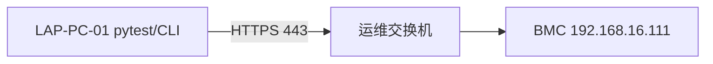

# BMC-AutoInsight 测试用例与自动化说明书

## 文档元数据

| 属性 | 值 |
|------|-----|
| 项目名称 | BMC-AutoInsight |
| 中文名称 | BMC全能自动化巡检工具 |
| 版本 | V1.1 |
| 文档日期 | 2026-05-20 |
| 文档类型 | 测试用例与自动化说明书 |
| 关联文档 | doc/BMC-AutoInsight_需求与设计.md |

## 修订历史

| 版本 | 日期 | 作者 | 说明 |
|------|------|------|------|
| V1.1 | 2026-05-20 | BMC AutoInsight 项目组 | 企业增强：交付验收用例、多品牌矩阵、与 V1.1 实现对齐 |
| V1.0 | 2026-05-20 | BMC AutoInsight 项目组 | 初版：62 条用例、自动化方案、稳定性测试与报告规范 |

## 目录

- [1. 测试范围](#1-测试范围)
- [2. 测试环境](#2-测试环境)
- [3. 测试用例](#3-测试用例)
- [4. 自动化测试方案](#4-自动化测试方案)
- [5. 稳定性测试](#5-稳定性测试)
- [6. 报告规范](#6-报告规范)
- [7. 附录](#7-附录)

---

## 1. 测试范围

### 1.1 在测范围

| 模块 | 路径 | 测试重点 |
|------|------|----------|
| AUTH | core/auth.py, core/client.py | 会话创建、Token、401 重登、异常凭证 |
| MONITOR | monitor/*, collector.py | 采集编排、403/404 降级、Mock 夹具 |
| FAULT_DETECT | fault_detect/engine.py, rules/* | 阈值告警、规则扩展、空数据鲁棒性 |
| API_TEST | api_test/runner.py, cases/smoke.yaml | YAML 驱动、状态码断言、CLI 退出码 |
| CONTROL | control/power.py | dry_run、confirm、Reset POST |
| REPORTS | reports/exporter.py | JSON/HTML 字段完整性 |
| CLI | main.py | 子命令、--mock、demo 端到端 |

### 1.2 不在测范围（V1.0）

- IPMI/SNMP 协议栈；
- 固件升级 `/UpdateService` 写操作；
- 多 BMC 并行编排（计划 V2）；
- Web UI 可视化控制台。

### 1.3 测试类型分布

| 类型 | 数量（约） | 说明 |
|------|------------|------|
| 正常 | 38 | 预期成功路径 |
| 异常 | 10 | 错误输入、HTTP 错误、权限拒绝 |
| 边界 | 6 | 超时、空数据、大负载、会话边界 |

---

## 2. 测试环境

### 2.1 实验室 BMC（LAB-01）

| 项 | 值 |
|----|-----|
| 环境编号 | LAB-01 |
| BMC IP | 192.168.16.111 |
| 协议 | Redfish 1.14.0 over HTTPS |
| 账号角色 | ADMIN（配置于 config/config.yaml） |
| 网络 | 运维 VLAN，与测试机二层可达 |
| 已知限制 | Storage **403**；EventLog Entries **404**（部分 URI） |

### 2.2 测试执行机（LAB-PC-01）

| 项 | 值 |
|----|-----|
| 操作系统 | Windows 10/11 或 Windows Server |
| Python | 3.10+ |
| 仓库路径 | `D:\新包验证\AI测试应用\BMC AutoInsight` |
| 依赖安装 | `pip install -r requirements.txt` |

### 2.3 网络拓扑



| 规则 | 说明 |
|------|------|
| 防火墙 | 测试机出站 443 放行 |
| DNS | 使用 IP 直连，不依赖域名 |
| 证书 | verify_ssl=false（实验室）；生产建议导入 BMC CA |

### 2.4 账号与配置

| 用途 | 来源 | 备注 |
|------|------|------|
| BMC 登录 | config/config.yaml `bmc.username/password` | 禁止提交真实密码到 git |
| 覆盖 | 环境变量 BMC_HOST/USER/PASS | CI 密文注入 |
| 电源安全 | power.dry_run=true | 真实复位需变更配置 + --confirm |

### 2.5 Mock 环境（OFFLINE-01）

| 项 | 值 |
|----|-----|
| 触发 | `python main.py --mock <cmd>` |
| 夹具目录 | tests/fixtures/redfish_responses/ |
| 文件 | service_root.json, system.json, thermal.json, power.json, storage.json, event_log.json, session.json |

---

## 3. 测试用例

共 **62** 条。优先级：P0 发版阻断，P1 常规回归，P2 增强。

### 3.1 用例总表

| 用例ID | 模块 | 类型 | 标题 | 前置条件 | 步骤 | 预期结果 | 优先级 |
|--------|------|------|------|----------|------|----------|--------|
| TC-AUTH-001 | AUTH | 正常 | 正确账号密码登录 | BMC 在线 | POST Sessions | 201 + Token | P1 |
| TC-AUTH-002 | AUTH | 正常 | 错误密码登录 | BMC 在线 | POST 错误密码 | 401/403 AuthError | P1 |
| TC-AUTH-003 | AUTH | 正常 | 空用户名 | BMC 在线 | UserName 为空 | 4xx 失败 | P1 |
| TC-AUTH-004 | AUTH | 正常 | 空密码 | BMC 在线 | Password 为空 | 4xx 失败 | P1 |
| TC-AUTH-005 | AUTH | 正常 | Token 缺失响应 | Mock 无头 | 解析响应 | AuthError | P1 |
| TC-AUTH-006 | AUTH | 正常 | 401 后自动重登 | Token 过期 | GET 触发401 | 重登成功 | P1 |
| TC-AUTH-007 | AUTH | 正常 | verify_ssl=true 自签 | 自签证书 | verify true | 可配置失败或导入CA | P1 |
| TC-AUTH-008 | AUTH | 正常 | timeout 超时 | 断网 | timeout=1 | RequestException | P1 |
| TC-AUTH-009 | AUTH | 正常 | 环境变量覆盖 host | 设 BMC_HOST | login-test | 连接新 host | P1 |
| TC-AUTH-010 | AUTH | 正常 | login-test CLI | 配置正确 | main.py login-test | 打印 session id | P1 |
| TC-AUTH-011 | AUTH | 正常 | mock 跳过登录 | --mock | login-test | 退出码 0 跳过 | P1 |
| TC-AUTH-012 | AUTH | 正常 | 并发双会话 | 两进程 | 各建会话 | 均成功或达上限 | P1 |
| TC-MON-001 | MONITOR | 正常 | inspect 采集系统 | 已登录 | inspect | 输出 Model/SN | P1 |
| TC-MON-002 | MONITOR | 正常 | Thermal 采集 | 已登录 | GET Thermal | 200 有 Temperatures | P1 |
| TC-MON-003 | MONITOR | 正常 | Power 采集 | 已登录 | GET Power | 200 有 PowerSupplies | P1 |
| TC-MON-004 | MONITOR | 正常 | Storage 403 降级 | LAB BMC | GET Storage | _skipped 403 | P1 |
| TC-MON-005 | MONITOR | 正常 | EventLog 404 降级 | LAB BMC | GET EventLog | _skipped 404 | P1 |
| TC-MON-006 | MONITOR | 正常 | version 采集 | 已登录 | GET Manager | FirmwareVersion | P1 |
| TC-MON-007 | MONITOR | 正常 | 单项失败不中断 | Mock 坏数据 | collect_all | 其他项仍返回 | P1 |
| TC-MON-008 | MONITOR | 正常 | mock inspect | --mock | inspect | 读 fixtures | P1 |
| TC-MON-009 | MONITOR | 正常 | collector system 路径 | Mock | Systems/1 | 与 system.json 一致 | P1 |
| TC-MON-010 | MONITOR | 正常 | collector thermal | Mock | thermal.json | Fans 数组存在 | P1 |
| TC-MON-011 | MONITOR | 正常 | collector power | Mock | power.json | PowerControl | P1 |
| TC-MON-012 | MONITOR | 正常 | collector storage fixture | Mock | storage.json | 不抛异常 | P1 |
| TC-MON-013 | MONITOR | 正常 | collector event_log fixture | Mock | event_log.json | 不抛异常 | P1 |
| TC-MON-014 | MONITOR | 正常 | InspectionResult.to_dict | demo | 导出字段齐全 | 含 host/mock | P1 |
| TC-FLT-001 | FAULT | 正常 | fault-check 无告警 | 正常 Mock | fault-check | 0 条或仅 info | P1 |
| TC-FLT-002 | FAULT | 正常 | CPU 温度 warn | 阈值75 | 注入76C | severity warn | P1 |
| TC-FLT-003 | FAULT | 正常 | CPU 温度 crit | 阈值85 | 注入86C | severity crit | P1 |
| TC-FLT-004 | FAULT | 正常 | 风扇低转速 | min_rpm 1500 | 注入1400 | fan 规则告警 | P1 |
| TC-FLT-005 | FAULT | 正常 | PSU 低压 | min 200V | 注入190 | psu 规则 | P1 |
| TC-FLT-006 | FAULT | 正常 | 磁盘空间不足 | min_free 10% | 注入5% | disk 规则 | P1 |
| TC-FLT-007 | FAULT | 正常 | RAID 降级 | Mock 坏条带 | raid.check | raid 发现 | P1 |
| TC-FLT-008 | FAULT | 正常 | 内存 ECC | ecc>=1 | 注入计数 | memory 规则 | P1 |
| TC-FLT-009 | FAULT | 正常 | 缺 thermal 数据 | 空对象 | engine | 不崩溃 | P1 |
| TC-FLT-010 | FAULT | 正常 | 阈值文件缺失 | 无 thresholds | 默认内置 | 使用默认 warn/crit | P1 |
| TC-API-001 | API_TEST | 正常 | service_root 200 | 已登录 | smoke service_root | PASS | P1 |
| TC-API-002 | API_TEST | 正常 | system 200 | 已登录 | smoke system | PASS | P1 |
| TC-API-003 | API_TEST | 正常 | 期望404 用例 | YAML expect 404 | 自定义用例 | PASS on 404 | P1 |
| TC-API-004 | API_TEST | 正常 | 错误 method | POST 只读资源 | 方法错误 | FAIL | P1 |
| TC-API-005 | API_TEST | 正常 | api-test 全通过 | Mock | api-test | exit 0 | P1 |
| TC-API-006 | API_TEST | 正常 | api-test 有失败 | 坏路径 | api-test | exit 1 | P1 |
| TC-API-007 | API_TEST | 正常 | YAML 缺 cases | 空文件 | load_cases | 空列表 | P1 |
| TC-API-008 | API_TEST | 正常 | 路径缺 leading slash | 配置修正 | runner 拼接 | 正常请求 | P1 |
| TC-API-009 | API_TEST | 正常 | demo 含 api_results | demo | 报告 | api_results 数组 | P1 |
| TC-API-010 | API_TEST | 正常 | 503 重试 | 模拟503 | client.request | 退避后成功 | P1 |
| TC-CTL-001 | CONTROL | 正常 | dry_run power on | dry_run true | power on | ok dry_run | P1 |
| TC-CTL-002 | CONTROL | 正常 | 无 confirm 拒绝 | require_confirm | power reset | ok false | P1 |
| TC-CTL-003 | CONTROL | 正常 | confirm 仍 dry_run | confirm + dry | power reset --confirm | 模拟成功 | P1 |
| TC-CTL-004 | CONTROL | 正常 | 真实 reset POST | dry false confirm | POST Reset | 202/204 | P1 |
| TC-CTL-005 | CONTROL | 正常 | power off 映射 | action off | GracefulShutdown | payload 正确 | P1 |
| TC-CTL-006 | CONTROL | 正常 | power on 映射 | action on | ResetType On | V2 完善 | P1 |
| TC-CTL-007 | CONTROL | 正常 | 非法 action | argparse | choices 限制 | 仅 on/off/reset | P1 |
| TC-CTL-008 | CONTROL | 正常 | 失败 HTTP 500 | BMC 错误 | 返回 ok false | status 500 | P1 |
| TC-AUTH-013 | AUTH | 边界 | 超长密码 | BMC 在线 | 256+ 字符 | 4xx 或截断 | P2 |
| TC-MON-015 | MONITOR | 边界 | 超大 EventLog | 1万条 | 分页未实现 | 仅首页或超时 | P2 |
| TC-FLT-011 | FAULT | 异常 | thresholds 非法 YAML | 损坏文件 | load | 默认或报错 | P2 |
| TC-API-011 | API_TEST | 边界 | 100 条用例 | YAML | 顺序执行 | <5min | P2 |
| TC-CTL-009 | CONTROL | 异常 | 巡检中复位 | 并发 | inspect+power | 互斥建议 | P2 |
| TC-MON-016 | MONITOR | 异常 | Redfish 500 | 服务器错误 | GET | RedfishError 或 skip | P1 |
| TC-AUTH-014 | AUTH | 边界 | Session 超时后再请求 | 空闲>30min | GET | 401 重登 | P1 |
| TC-FLT-012 | FAULT | 边界 | 温度 null | 无 ReadingCelsius | 跳过 | 无发现 | P2 |

### 3.2 用例分组统计

| 前缀 | 数量 |
|------|------|
| TC-AUTH | 14 |
| TC-MON | 16 |
| TC-FLT | 12 |
| TC-API | 11 |
| TC-CTL | 9 |
| **合计** | **62** |

---

## 4. 自动化测试方案

### 4.1 框架与目录

```
tests/
├── conftest.py              # 注入 ROOT 到 sys.path
├── test_auth.py             # SessionManager 属性等
├── test_fault_detect.py     # 规则与引擎
└── fixtures/redfish_responses/   # Mock JSON
```

执行：

```bash
python -m pytest tests -q
python -m pytest tests -v --tb=short
```

### 4.2 日志

- 统一使用 `core/logger.py` 的 `setup_logging()`；
- 配置项 `logging.level`：DEBUG 用于排查 Redfish 原始 status；
- 建议在 CI 中设置 `INFO`，失败用例附加 `-s` 显示 log。

### 4.3 重试策略

| 层级 | 行为 |
|------|------|
| HTTP 客户端 | 401 → 重新 login；503 → 指数退避 2^n 秒 |
| 采集 | 单项失败 `_safe_collect` 不重试整包 |
| pytest | 可对集成用例使用 `@pytest.mark.flaky(reruns=2)`（可选安装插件） |

### 4.4 CI 集成建议

```yaml
# 示例 GitHub Actions 片段
- run: pip install -r requirements.txt
- run: python -m pytest tests -q
- run: python main.py --mock demo
```

### 4.5 LAB 集成测试清单

1. `python main.py login-test` → 会话成功；
2. `python main.py inspect` → 打印 Model/SN，Storage/EventLog 允许 skipped；
3. `python main.py fault-check` → 输出发现条数；
4. `python main.py api-test` → 冒烟 PASS；
5. **禁止** 在未授权下对 LAB 执行 `power` 真实写操作。

---

## 5. 稳定性测试

| 编号 | 名称 | 方法 | 通过标准 |
|------|------|------|----------|
| ST-01 | 长时间循环巡检 | `inspect` 每 5min × 24h | 无内存泄漏；失败率 < 1% |
| ST-02 | 会话风暴 | 连续 login-test 500 次 | BMC 不崩溃；工具错误率 < 2% |
| ST-03 | 503 恢复 | 模拟维护窗口 503 | 退避后自动恢复成功 |
| ST-04 | Mock demo 压测 | `demo` 连续 100 次 | 报告均生成；无未捕获异常 |
| ST-05 | 混合命令 | inspect + fault-check + api-test 随机顺序 8h | 无死锁；日志无 ERROR 风暴 |

---

## 6. 报告规范

### 6.1 巡检 JSON 报告

- 路径：`reports/report_YYYYMMDD_HHMMSS.json`；
- 编码：UTF-8，`ensure_ascii=False`；
- 必含字段：`host`, `mock`, `system`, `thermal`, `power`, `storage`, `event_log`, `version`, `faults`, `api_results`；
- 敏感信息：不得包含 `password`、完整 `X-Auth-Token`。

### 6.2 巡检 HTML 报告

- 路径：`reports/report_YYYYMMDD_HHMMSS.html`；
- 内容：主机、时间、故障列表、系统 JSON 摘要、API 测试结果表；
- 样式：内联 CSS，便于邮件附件查看。

### 6.3 pytest 文本报告

- 命令：`python -m pytest tests -q --junitxml=reports/junit.xml`（可选）；
- 用途：CI 趋势与通过率统计。

### 6.4 报告评审检查表

| 检查项 | JSON | HTML | JUnit |
|--------|------|------|-------|
| 时间戳正确 | ✓ | ✓ | ✓ |
| 故障 severity 合法 | ✓ | ✓ | N/A |
| API passed 与 status 一致 | ✓ | ✓ | N/A |
| LAB skipped 资源标注 | ✓ | 建议 | N/A |

---

## 7. 附录

### 附录 A — pytest 命令速查

```bash
python -m pytest tests -q
python -m pytest tests/test_auth.py -v
python -m pytest tests/test_fault_detect.py -v
```

### 附录 B — Mock 夹具与真实 LAB 对照

| 资源 | Mock 文件 | LAB-01 典型状态 |
|------|-----------|-----------------|
| ServiceRoot | service_root.json | 200, v1.14.0 |
| Storage | storage.json | **403** |
| EventLog | event_log.json | **404** 或 200 |
| Thermal | thermal.json | 200 |

### 附录 C — 缺陷记录模板

| 字段 | 说明 |
|------|------|
| 缺陷ID | BUG-YYYYMMDD-序号 |
| 关联用例 | 如 TC-MON-004 |
| BMC 版本 | Redfish 1.14.0 |
| 复现步骤 | |
| 期望/实际 | |

### 附录 D — 测试数据 JSON 片段（API 结果）

```json
{
  "name": "service_root",
  "path": "/redfish/v1/",
  "status": 200,
  "expect": 200,
  "passed": true
}
```

### 附录 E — 环境检查脚本（示意）

```powershell
Test-NetConnection 192.168.16.111 -Port 443
python main.py login-test
python main.py --mock demo
```

### 附录 F — 企业交付验收用例（增补）

| 用例ID | 场景 | 预期 |
|--------|------|------|
| TC-ENT-001 | 超微 Storage 返回 403 | 巡检退出码 0；报告含「存储模块权限受限」中文提示 |
| TC-ENT-002 | EventLog 全路径探测失败 | 退出码 0；`customer_notice_zh` 或探测摘要落盘 |
| TC-ENT-003 | `config.ini` 仅改 host/password | 可完成 login-test 与 inspect |
| TC-ENT-004 | 批量 CSV 两台 BMC | `batch-inspect` 生成汇总 Excel 工作表 Batch |
| TC-ENT-005 | 电源 dry_run | `power reset --confirm` 不发起真实 POST |
| TC-ENT-006 | 电源真实（实验室） | `--confirm --yes-danger` 且 dry_run=false 才执行 |

### 附录 G — 多品牌兼容性测试矩阵（增补）

| 品牌 / 机型 | EventLog 策略 | Storage 典型限制 |
|---------------|---------------|-------------------|
| 超微 | 枚举 LogServices + 回退 | 常见 403，依赖账号权限 |
| Dell iDRAC | 回退 EventLog/SEL | 一般可读 |
| 联想 IMM | 枚举 + 标准路径 | 依固件版本 |
| 浪潮 / 华为 | 扩展路径 `/Logs/...` 尝试 | 部分需 OEM 许可 |

---

## 8. 新增测试用例

本章承接前文用例编号体系（可视为 **TC-XXX 系列扩展**），覆盖近期交付中追加的：**电源精细化子命令与安全参数**、**硬件信息聚合查询**、**API 冒烟自动发现**、**reports 目录清理 CLI**、**传感器占位文案**。执行方式分为 **pytest 自动化（推荐门禁）** 与 **LAB/准生产手工或半自动**两类；与 **§4.5 LAB 清单**冲突时仍以「未授权不写电源」为原则。

### 8.1 电源控制测试

| 用例 ID | 类型 | 前置条件 | 步骤 | 期望结果 |
|---------|------|----------|------|----------|
| **TC-PWR-101** | 自动化(Mock/桩) | `config.ini` 中 `[power].dry_run=true`（或未改默认） | 执行 `power-on --confirm`，**不传** `--execute` | BMC **未收到**真实电源变更请求（或 CLI/日志明示 dry_run）；退出码反映「策略拒绝真实下发」或「仅模拟」（以当前实现返回为准） |
| **TC-PWR-102** | 自动化/手工 | 已可登录 BMC | 执行 `power-off` **不带** `--confirm` | CLI **拒绝执行**；不产生有效 Redfish POST |
| **TC-PWR-103** | 手工（LAB） | 维护窗口、`dry_run=false`（或等价配置）、本人已授权变更 | `power-status` → `power-off --confirm --execute`（或配置允许的真实路径）→ 再次 `power-status` | 第二次状态反映 **关机**；全程可审计日志 |
| **TC-PWR-104** | 手工（LAB） | 同上，主机允许上电 | `power-on --confirm --execute` → `power-status` | **PowerState=On**（或等价枚举值） |
| **TC-PWR-105** | 手工（LAB） | 主机处于可重启态 | `power-restart --confirm --execute`，观察操作系统或 BMC 会话 | **完成重启语义**且无未处理异常；（高危，仅 LAB） |
| **TC-PWR-106** | 回归 | `/control/power.py` / `main.py` 改动后 | `--mock power-status`（若支持）或直接读帮助 `python main.py power-on --help` | **`--confirm`/`--execute`/`dry_run`** 说明与实现对齐 |

> **说明**：若组织内仍沿用历史文档中的 `--yes-danger` / 环境变量二次确认写法，请以 **当前分支 `README.md`/`doc/常用命令.md` 与实际 argparse** 为准，将表中「`--execute`」列理解为「等价于获准真实下发的显式放行参数」。

### 8.2 硬件信息测试

| 用例 ID | 类型 | 前置条件 | 步骤 | 期望结果 |
|---------|------|----------|------|----------|
| **TC-HW-101** | 自动化(Mock) | `tests/fixtures/redfish_responses` 完备 | `pytest tests/test_hardware_info.py -q` | `summary.model/serial_number/bios_version/bmc_firmware_version` 等与夹具一致；CPU/内存/磁盘条目数符合 fixture |
| **TC-HW-102** | 手工（LAB） | `login-test` 通过 | `python main.py hardware-info` | 控制台与导出报告中 **BIOSVersion**、**Managers.FirmwareVersion**（或等价字段）与 BMC Web 「固件信息」肉眼一致或在允许误差范围内 |
| **TC-HW-103** | 手工（LAB） | Redfish 开放 Processors/Memory | 同上命令，核对输出表 | CPU 型号/核数（或条目）与工单或 Web 摘要一致；内存条容量/通道信息**非空或可解释为空**（受权限约束） |

### 8.3 API 冒烟测试（Redfish 连通性）

| 用例 ID | 类型 | 前置条件 | 步骤 | 期望结果 |
|---------|------|----------|------|----------|
| **TC-API-110** | 自动化(Mock) | 依赖 yaml + mock client | `pytest tests/test_api_smoke.py -q` | 发现路径、`run_auto_smoke` **全部 PASSED**、`status==200` |
| **TC-API-111** | 自动化 | 改动 `discovery.py`/`runner.py` | `pytest tests/test_report_export.py`（若包含 API HTML 占位）或直接跑 `inspect` Mock | HTML **「API 冒烟」**区非空或有明确占位说明；不出现未渲染模板残片 `{%%` |
| **TC-API-112** | 手工（LAB） | Session 可用 | `python main.py api-test --max-paths 30` | 每条记录含 **path、HTTP status、passed**；非 403 的路径以 200 为主；已知 **403 资源可记 FAIL**并在变更说明中备注 |
| **TC-API-113** | 集成 | `/inspect` 流程 | `python main.py inspect` 后打开 HTML | 报告中 **API 冒烟表**与会话期控制台汇总 **条数一致** |

### 8.4 报告清理测试（`clean-reports`）

| 用例 ID | 类型 | 前置条件 | 步骤 | 期望结果 |
|---------|------|----------|------|----------|
| **TC-RPT-120** | 自动化 | CI 或无历史污染 temp | `pytest tests/test_report_cleaner.py -q` | 「保留最近 N **组**时间戳导出」：**旧 stem 文件被删**、近两组 stem **完整保留**；`exporter.py` 仍存在 |
| **TC-RPT-121** | 手工 | `reports/` 下有多组带时间戳前缀文件 | `python main.py clean-reports --keep 5 --dry-run` | **仅打印**将删/保留列表；磁盘文件数与哈希**不变** |
| **TC-RPT-122** | 手工 | 同上 | `python main.py clean-reports --keep 3`（无 dry-run） | 仅保留 **最近 3 组**「时间戳 stem」导出（每组仍可含 html/json/xlsx/txt 等）；非时间戳命名文件未被误删 |

### 8.5 传感器提示测试（开机 vs 关机）

| 用例 ID | 类型 | 前置条件 | 步骤 | 期望结果 |
|---------|------|----------|------|----------|
| **TC-SEN-130** | 自动化 | 无 BMC | `pytest tests/test_sensor_display.py -q` | `PowerState=On` 且读数 `None` → 文案 **`【该传感器未上报数据】`**；`Off` → **`【服务器关机，传感器无数据】`** |
| **TC-SEN-131** | 手工（LAB/Mock） | 可构造 Thermal 条目读数为空 | 执行 `inspect` 或 **`--mock demo`** → 抽查 HTML/Txt/Excel | 占位文案与 **§自动用例断言**一致，无中英文混错位 |

### 8.6 CI 门禁建议（增量）

在第 **§4.4 CI 示例**基础上，可增加（可选）：

```bash
pytest tests/test_hardware_info.py tests/test_api_smoke.py tests/test_report_cleaner.py tests/test_sensor_display.py -q
python main.py clean-reports --dry-run --keep 5   # 无报错即可；或限定在 fixtures 目录的集成副本中执行
```

---

*文档结束 — BMC-AutoInsight V1.1 企业增强版 — 用例总数 62+；文末「第 8 章 新增测试用例」为功能追加条目*

