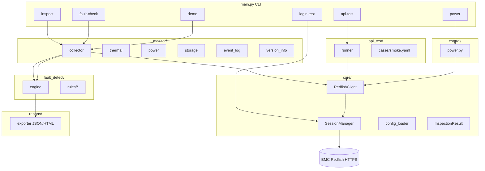
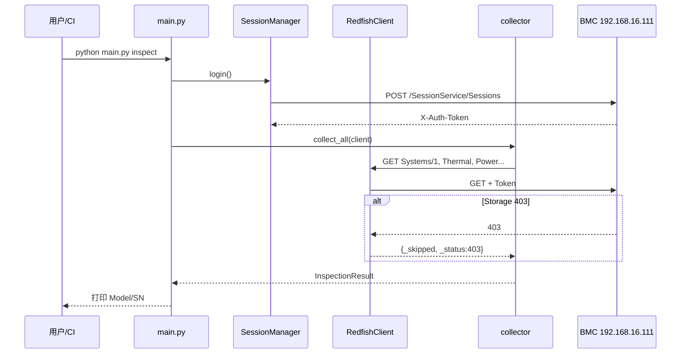

# BMC-AutoInsight 需求与设计说明书

## 文档元数据

| 属性 | 值 |
|------|-----|
| 项目名称 | BMC-AutoInsight |
| 中文名称 | BMC全能自动化巡检工具 |
| 版本 | V1.1 |
| 文档日期 | 2026-05-20 |
| 文档类型 | 需求与设计说明书 |
| 适用对象 | 研发、测试、运维、BMC 集成工程师 |

## 修订历史

| 版本 | 日期 | 作者 | 说明 |
|------|------|------|------|
| V1.1 | 2026-05-20 | BMC AutoInsight 项目组 | 企业增强：config.ini、批量巡检、EventLog 探测、报告四件套、电源双确认 |
| V1.0 | 2026-05-20 | BMC AutoInsight 项目组 | 初版：四大模块需求、架构、Redfish 接口与附录 |

## 目录

- [1. 项目概述](#1-项目概述)
- [2. 功能需求](#2-功能需求)
  - [2.1 AUTH 鉴权模块](#21-auth-鉴权模块)
  - [2.2 MONITOR 硬件巡检模块](#22-monitor-硬件巡检模块)
  - [2.3 FAULT_DETECT 故障检测模块](#23-fault_detect-故障检测模块)
  - [2.4 API_TEST 接口测试模块](#24-api_test-接口测试模块)
  - [2.5 CONTROL 电源控制模块](#25-control-电源控制模块)
- [3. 非功能需求](#3-非功能需求)
- [4. 系统架构与目录结构](#4-系统架构与目录结构)
- [5. 关键技术](#5-关键技术)
- [6. Redfish 接口设计](#6-redfish-接口设计)
- [7. 附录](#7-附录)

---

## 1. 项目概述

### 1.1 用途

BMC-AutoInsight（BMC全能自动化巡检工具）是一套基于 **Redfish over HTTPS** 的带外运维工具，面向服务器 BMC 提供：

1. **会话鉴权**：通过 `SessionService` 建立带 `X-Auth-Token` 的 Redfish 会话；
2. **硬件巡检**：采集系统、散热、电源、存储、事件日志、固件版本等信息；
3. **故障检测**：依据可配置阈值与规则引擎对温度、风扇、PSU、磁盘、RAID、内存等做规则判定；
4. **接口测试**：以 YAML 用例驱动 Redfish 冒烟与回归；
5. **电源控制**：在 dry-run / 二次确认保护下执行开机、关机、复位；
6. **报告导出**：生成 JSON/HTML 巡检报告（`reports/`）。

入口为仓库根目录 `main.py`，支持 `--mock` 使用 `tests/fixtures/redfish_responses/` 离线演示。

### 1.2 适用场景

| 场景 | 说明 |
|------|------|
| 产线/库房初检 | 批量登录 BMC，拉取型号/序列号/固件版本 |
| 数据中心例行巡检 | 定时采集 Thermal/Power/Storage，输出 HTML 报告 |
| 故障预警 | 结合 `config/thresholds.yaml` 对温度、风扇转速、电压等告警 |
| Redfish 兼容性验证 | 对比不同 BMC 厂商对 Storage、EventLog 等资源的实现差异 |
| 接口回归 | `api_test/cases/smoke.yaml` 扩展用例，集成 CI |
| 带外电源操作 | 维护窗口内远程 Reset（需关闭 dry_run 并 `--confirm`） |

**实验室参考 BMC**（已写入 `config/config.yaml`）：

- 地址：`192.168.16.111`
- Redfish 版本：**1.14.0**（`@odata.type` 与 `RedfishVersion` 字段）
- 已知差异：`/redfish/v1/Systems/1/Storage` 返回 **403 Forbidden**；`/redfish/v1/Systems/1/LogServices/EventLog/Entries` 部分路径返回 **404 Not Found**。工具通过 `RedfishClient.get_json(..., optional=True)` 与 `collector._safe_collect` 降级处理，不中断整次巡检。

---

## 2. 功能需求

需求编号约定：**FR-模块-序号**（功能需求），**FD-模块-序号**（检测/设计约束，Design constraint）。

### 2.1 AUTH 鉴权模块

实现路径：`core/auth.py`（`SessionManager`）、`core/client.py`（401 自动重登）。

| ID | 类型 | 描述 | 优先级 |
|----|------|------|--------|
| FR-AUTH-001 | 功能 | 支持 POST `/redfish/v1/SessionService/Sessions` 创建会话，解析 `X-Auth-Token` 与 `Location`/`Id` | P0 |
| FR-AUTH-002 | 功能 | 支持环境变量 `BMC_HOST`、`BMC_USER`、`BMC_PASS` 覆盖配置文件 | P1 |
| FR-AUTH-003 | 功能 | 提供 CLI `login-test` 独立验证登录 | P1 |
| FR-AUTH-004 | 功能 | HTTPS 可配置 `verify_ssl`（默认 false，适配自签证书） | P1 |
| FD-AUTH-001 | 约束 | 登录失败 HTTP 非 200/201 时抛出 `AuthError` | P0 |
| FD-AUTH-002 | 约束 | 响应无 `X-Auth-Token` 时拒绝继续 | P0 |
| FD-AUTH-003 | 约束 | 后续请求 401 时最多重试 `max_retries` 次并重新 `login()` | P0 |

### 2.2 MONITOR 硬件巡检模块

实现路径：`monitor/collector.py` 编排；子模块 `thermal.py`、`power.py`、`storage.py`、`event_log.py`、`version_info.py`。

| ID | 类型 | 描述 | 优先级 |
|----|------|------|--------|
| FR-MON-001 | 功能 | `inspect` 命令采集 Systems/1 基本信息 | P0 |
| FR-MON-002 | 功能 | 采集 Chassis/1/Thermal（温度、风扇） | P0 |
| FR-MON-003 | 功能 | 采集 Chassis/1/Power（PSU、功耗） | P0 |
| FR-MON-004 | 功能 | 采集 Systems/1/Storage（optional，403 时跳过） | P0 |
| FR-MON-005 | 功能 | 采集 EventLog Entries（optional，404 时跳过） | P0 |
| FR-MON-006 | 功能 | 采集 Manager/固件版本信息 | P1 |
| FR-MON-007 | 功能 | 单项采集失败不中断整体（`_safe_collect`） | P0 |
| FD-MON-001 | 约束 | 返回结构封装为 `InspectionResult`（`core/models.py`） | P0 |
| FD-MON-002 | 约束 | Mock 模式从 `tests/fixtures/redfish_responses/*.json` 读取 | P1 |

### 2.3 FAULT_DETECT 故障检测模块

实现路径：`fault_detect/engine.py`；规则 `fault_detect/rules/`（`fan.py`、`psu.py`、`raid.py`、`disk.py`、`memory.py`）。

| ID | 类型 | 描述 | 优先级 |
|----|------|------|--------|
| FR-FLT-001 | 功能 | `fault-check` 基于巡检快照运行全部规则 | P0 |
| FR-FLT-002 | 功能 | 温度超过 `cpu_temp_warn_c` / `cpu_temp_crit_c` 产生 warn/crit | P0 |
| FR-FLT-003 | 功能 | 风扇转速低于 `min_rpm_warn` / `min_rpm_crit` 告警 | P1 |
| FR-FLT-004 | 功能 | PSU 输入电压低于 `min_input_voltage` 告警 | P1 |
| FR-FLT-005 | 功能 | 磁盘空间、RAID、内存 ECC 规则可扩展 | P2 |
| FD-FLT-001 | 约束 | 每条发现含 `rule`、`severity`、`message` 字段 | P0 |
| FD-FLT-002 | 约束 | 阈值来自 `config/thresholds.yaml`（示例见 `thresholds.yaml.example`） | P0 |

### 2.4 API_TEST 接口测试模块

实现路径：`api_test/runner.py`、`api_test/cases/smoke.yaml`。

| ID | 类型 | 描述 | 优先级 |
|----|------|------|--------|
| FR-API-001 | 功能 | 从 YAML 加载用例列表（name、method、path、expect_status） | P0 |
| FR-API-002 | 功能 | `api-test` CLI 执行并打印 PASS/FAIL | P0 |
| FR-API-003 | 功能 | `demo` 流程将 API 结果写入报告 | P1 |
| FR-API-004 | 功能 | 支持扩展用例文件（多 smoke/regression 套件） | P2 |
| FD-API-001 | 约束 | 非 2xx 且与 expect 不符则用例失败 | P0 |
| FD-API-002 | 约束 | Mock 客户端无真实 HTTP status 时按 200 处理 | P1 |

### 2.5 CONTROL 电源控制模块

实现路径：`control/power.py`。

| ID | 类型 | 描述 | 优先级 |
|----|------|------|--------|
| FR-CTL-001 | 功能 | 支持 `power on|off|reset` 子命令 | P0 |
| FR-CTL-002 | 功能 | 默认 `dry_run: true`，仅记录日志不真实 POST | P0 |
| FR-CTL-003 | 功能 | `require_confirm: true` 时必须 `--confirm` | P0 |
| FR-CTL-004 | 功能 | 真实操作 POST `ComputerSystem.Reset`，ResetType 映射 | P0 |
| FD-CTL-001 | 约束 | dry_run 关闭且未 confirm 时返回 ok=false | P0 |
| FD-CTL-002 | 约束 | 接受 HTTP 200/202/204 为成功 | P0 |

---

## 3. 非功能需求

| ID | 类别 | 要求 |
|----|------|------|
| NFR-001 | 性能 | 单次巡检（不含 Storage/EventLog 重试）目标 < 60s（timeout=30s） |
| NFR-002 | 可靠性 | Redfish 503 指数退避重试；网络异常最多 3 次 |
| NFR-003 | 安全性 | 密码仅存配置文件或环境变量，不得写入报告明文 |
| NFR-004 | 可维护性 | 模块划分 core/monitor/fault_detect/api_test/control/reports/tests |
| NFR-005 | 可测试性 | pytest + Mock 夹具，无需真实 BMC 即可 CI |
| NFR-006 | 可移植性 | Python 3.10+；可选 PyInstaller 打包 `dist/BMC-AutoInsight.exe` |
| NFR-007 | 可观测性 | 统一 logging（`core/logger.py`），级别由 config 配置 |
| NFR-008 | 兼容性 | 适配 Redfish 1.x；对 403/404 optional 资源优雅降级 |

---

## 4. 系统架构与目录结构

### 4.1 逻辑架构



### 4.2 巡检数据流



### 4.3 仓库目录结构（实际）

```
BMC AutoInsight/
├── main.py                 # CLI 入口
├── build_exe.py            # PyInstaller 打包
├── requirements.txt
├── README.md
├── config/
│   ├── config.yaml         # 运行配置（含 LAB BMC）
│   ├── config.yaml.example
│   └── thresholds.yaml.example
├── core/
│   ├── auth.py             # SessionManager
│   ├── client.py           # RedfishClient + 重试
│   ├── config_loader.py
│   ├── exceptions.py
│   ├── logger.py
│   ├── models.py           # InspectionResult
│   └── mock_client.py
├── monitor/
│   ├── collector.py
│   ├── thermal.py
│   ├── power.py
│   ├── storage.py
│   ├── event_log.py
│   └── version_info.py
├── fault_detect/
│   ├── engine.py
│   └── rules/              # fan, psu, raid, disk, memory
├── api_test/
│   ├── runner.py
│   └── cases/smoke.yaml
├── control/
│   └── power.py
├── reports/
│   ├── exporter.py
│   └── report_*.json/html
├── tests/
│   ├── conftest.py
│   ├── test_auth.py
│   ├── test_fault_detect.py
│   └── fixtures/redfish_responses/
└── doc/                    # 本文档目录
```

---

## 5. 关键技术

| 技术 | 用途 |
|------|------|
| Python 3.10+ | 主语言 |
| requests | HTTPS Redfish 调用 |
| PyYAML | API 用例与配置解析 |
| pytest | 单元与集成测试 |
| argparse | CLI 子命令 |
| Jinja2（可选） | HTML 报告模板渲染 |
| PyInstaller | Windows 单文件 exe |

**核心设计模式**：

- **Protocol/Callable 采集器**：`collector` 对 client 仅要求 `get_json`；
- **optional GET**：兼容 LAB BMC Storage 403、EventLog 404；
- **防御性编排**：`_safe_collect` 隔离单项失败；
- **配置分离**：`config.yaml`（连接/电源/日志）与 `thresholds.yaml`（阈值）。

---

## 6. Redfish 接口设计

基址：`https://192.168.16.111`（示例）。通用请求头：

```http
Content-Type: application/json
X-Auth-Token: <token>
```

### 6.1 服务根 — GET /redfish/v1/

**请求**

```http
GET /redfish/v1/ HTTP/1.1
Host: 192.168.16.111
```

**响应示例（200）**

```json
{
  "@odata.id": "/redfish/v1/",
  "RedfishVersion": "1.14.0",
  "UUID": "00000000-0000-0000-0000-000000000001",
  "Systems": { "@odata.id": "/redfish/v1/Systems" }
}
```

### 6.2 创建会话 — POST /redfish/v1/SessionService/Sessions

**请求**

```json
{
  "UserName": "ADMIN",
  "Password": "<secret>"
}
```

**响应（201）**

```http
HTTP/1.1 201 Created
Location: /redfish/v1/SessionService/Sessions/1a2b3c
X-Auth-Token: 7f3e9a1b2c4d5e6f
```

```json
{
  "@odata.id": "/redfish/v1/SessionService/Sessions/1a2b3c",
  "Id": "1a2b3c",
  "UserName": "ADMIN"
}
```

### 6.3 删除会话 — DELETE /redfish/v1/SessionService/Sessions/{id}

**响应（200/204）**：会话销毁（工具 V1.0 可选实现）。

### 6.4 系统信息 — GET /redfish/v1/Systems/1

**响应示例（200）**

```json
{
  "@odata.id": "/redfish/v1/Systems/1",
  "Id": "1",
  "Manufacturer": "Vendor",
  "Model": "R750",
  "SerialNumber": "SN123456",
  "PowerState": "On",
  "Status": { "State": "Enabled", "Health": "OK" }
}
```

### 6.5 散热 — GET /redfish/v1/Chassis/1/Thermal

**响应示例（200）**

```json
{
  "Temperatures": [
    { "MemberId": "CPU1", "ReadingCelsius": 42, "Status": { "Health": "OK" } }
  ],
  "Fans": [
    { "MemberId": "Fan1", "Reading": 5200, "Units": "RPM" }
  ]
}
```

### 6.6 电源 — GET /redfish/v1/Chassis/1/Power

**响应示例（200）**

```json
{
  "PowerControl": [{ "PowerConsumedWatts": 210 }],
  "PowerSupplies": [
    { "MemberId": "PSU1", "LineInputVoltage": 220, "Status": { "Health": "OK" } }
  ]
}
```

### 6.7 存储 — GET /redfish/v1/Systems/1/Storage

**LAB 实测（403）**

```http
HTTP/1.1 403 Forbidden
```

工具处理：`optional=True` → `{"_skipped": true, "_status": 403, "_path": "..."}`。

### 6.8 事件日志 — GET /redfish/v1/Systems/1/LogServices/EventLog/Entries

**LAB 部分路径（404）**

```http
HTTP/1.1 404 Not Found
```

**成功时示例（200）**

```json
{
  "Members": [
    { "Id": "1", "Severity": "Warning", "Message": "Fan redundancy lost" }
  ],
  "Members@odata.count": 1
}
```

### 6.9 管理器 — GET /redfish/v1/Managers/1

**响应示例（200）**

```json
{
  "Id": "1",
  "FirmwareVersion": "2.10.0",
  "DateTime": "2026-05-20T08:00:00+00:00"
}
```

### 6.10 固件清单 — GET /redfish/v1/UpdateService/FirmwareInventory

**响应示例（200）**

```json
{
  "Members": [
    { "@odata.id": "/redfish/v1/UpdateService/FirmwareInventory/BMC" }
  ]
}
```

### 6.11 机箱 — GET /redfish/v1/Chassis/1

**响应示例（200）**

```json
{
  "Id": "1",
  "ChassisType": "RackMount",
  "Thermal": { "@odata.id": "/redfish/v1/Chassis/1/Thermal" },
  "Power": { "@odata.id": "/redfish/v1/Chassis/1/Power" }
}
```

### 6.12 会话服务 — GET /redfish/v1/SessionService

**响应示例（200）**

```json
{
  "ServiceEnabled": true,
  "SessionTimeout": 1800,
  "Sessions": { "@odata.id": "/redfish/v1/SessionService/Sessions" }
}
```

### 6.13 账户服务 — GET /redfish/v1/AccountService

**响应示例（200）**

```json
{
  "ServiceEnabled": true,
  "Accounts": { "@odata.id": "/redfish/v1/AccountService/Accounts" }
}
```

### 6.14 系统复位 — POST /redfish/v1/Systems/1/Actions/ComputerSystem.Reset

**请求**

```json
{ "ResetType": "ForceRestart" }
```

**响应（202）**

```http
HTTP/1.1 202 Accepted
```

### 6.15 电源开机（Graceful）— POST ResetType On

**请求**

```json
{ "ResetType": "On" }
```

### 6.16 电源关机 — POST ResetType GracefulShutdown

**请求**

```json
{ "ResetType": "GracefulShutdown" }
```

### 6.17 Ethernet 接口 — GET /redfish/v1/Managers/1/EthernetInterfaces

**响应示例（200）**

```json
{
  "Members": [
    { "IPv4Addresses": [{ "Address": "192.168.16.111" }] }
  ]
}
```

### 6.18 处理器 — GET /redfish/v1/Systems/1/Processors

**响应示例（200）**

```json
{
  "Members": [
    { "Model": "Intel Xeon", "TotalCores": 16 }
  ]
}
```

### 6.19 内存 — GET /redfish/v1/Systems/1/Memory

**响应示例（200）**

```json
{
  "Members": [
    { "CapacityMiB": 32768, "Status": { "Health": "OK" } }
  ]
}
```

### 6.20 健康汇总 — GET /redfish/v1/Systems/1/Processors?$expand=.($levels=1)

（可选扩展查询，V2 规划；V1.0 以单资源 GET 为主。）

---

## 7. 附录

### 附录 A — config.yaml 示例

```yaml
bmc:
  host: "192.168.16.111"
  username: "ADMIN"
  password: "<从环境变量或密钥库获取>"
  verify_ssl: false
  timeout: 30
power:
  dry_run: true
  require_confirm: true
logging:
  level: INFO
```

### 附录 B — thresholds.yaml 示例

```yaml
thermal:
  cpu_temp_warn_c: 75
  cpu_temp_crit_c: 85
fan:
  min_rpm_warn: 1500
  min_rpm_crit: 1000
psu:
  min_input_voltage: 200
disk:
  min_free_percent: 10
memory:
  ecc_error_warn: 1
```

### 附录 C — CLI 命令速查

| 命令 | 说明 |
|------|------|
| `python main.py demo` | Mock 全流程 + 报告 |
| `python main.py inspect` | 硬件巡检 |
| `python main.py fault-check` | 故障规则检测 |
| `python main.py api-test` | Redfish 冒烟 |
| `python main.py login-test` | 登录验证 |
| `python main.py power reset --confirm` | 电源复位（需关闭 dry_run） |
| `python main.py --mock inspect` | 使用本地 JSON 夹具 |

### 附录 D — InspectionResult JSON Schema（示意）

```json
{
  "$schema": "http://json-schema.org/draft-07/schema#",
  "title": "InspectionResult",
  "type": "object",
  "properties": {
    "host": { "type": "string" },
    "mock": { "type": "boolean" },
    "system": { "type": "object" },
    "thermal": { "type": "object" },
    "power": { "type": "object" },
    "storage": { "type": "object" },
    "event_log": { "type": "object" },
    "version": { "type": "object" },
    "faults": {
      "type": "array",
      "items": {
        "type": "object",
        "required": ["rule", "severity", "message"],
        "properties": {
          "rule": { "type": "string" },
          "severity": { "enum": ["warn", "crit", "info"] },
          "message": { "type": "string" }
        }
      }
    },
    "api_results": {
      "type": "array",
      "items": {
        "type": "object",
        "properties": {
          "name": { "type": "string" },
          "path": { "type": "string" },
          "status": { "type": "integer" },
          "passed": { "type": "boolean" }
        }
      }
    }
  }
}
```

### 附录 E — 故障发现 JSON 示例

```json
{
  "rule": "thermal",
  "severity": "warn",
  "message": "CPU1 温度偏高: 76C"
}
```

### 附录 F — LAB BMC 兼容性说明

| 资源路径 | LAB 状态 | 工具行为 |
|----------|----------|----------|
| /redfish/v1/ | 200 | 正常解析 RedfishVersion 1.14.0 |
| /redfish/v1/Systems/1/Storage | **403** | optional 跳过，记录 `_status` |
| /redfish/v1/.../EventLog/Entries | **404**（部分） | optional 跳过 |
| /redfish/v1/Chassis/1/Thermal | 200 | 参与故障检测 |
| /redfish/v1/Chassis/1/Power | 200 | 参与故障检测 |

---

## 9. 企业商用交付增强（V1.1）

### 9.1 设计目标

- **稳定性**：分阶段超时（连接超时 / 读超时）、整次巡检超时、网络抖动重试、401 主动刷新会话、可选按周期会话保活。
- **容错**：单个子资源 403/404 不中断全局巡检；存储 403 在报告中输出 **`customer_notice_zh`** 明确「权限受限、厂商未开放」。
- **多品牌 EventLog**：先枚举 `Systems/{id}/LogServices` 各成员的 `Entries`，失败则回退常见路径（含部分华为/浪潮扩展路径）及 `Managers/.../LogServices`。

### 9.2 配置形态

- 主配置 **`config/config.ini`**（分节：`[basic]` / `[threshold]` / `[logging]` / `[power]` / `[retry]`），支持 `BMC_HOST`、`BMC_USER`、`BMC_PASS` 环境变量覆盖。
- 可选 **`config/thresholds.yaml`** 覆盖温度/风扇等阈值（与 ini 合并）。

### 9.3 报告与交付物

- 默认导出 **JSON + HTML + TXT + XLSX**（时间戳文件名，位于 `reports/`）。
- Excel 中告警行使用红色字体；存储/权限类说明行使用浅黄背景提示。

### 9.4 批量巡检

- CSV 列：`host`,`port`,`username`,`password`,`verify_ssl`（参见 `config/batch_targets.example.csv`），命令：`python main.py batch-inspect -f <csv>`。

### 9.5 电源安全

- `dry_run` 默认开启；真实执行需 `--confirm` + `--yes-danger`（或环境变量 `BMC_POWER_CONFIRM=yes`）。

---

## 10. 版本更新说明（功能追加）

以下条目为在既有 **「第 9 章 企业商用交付增强」**及前文功能基础上的**追加能力摘要**，不改变前述章节结构与需求编号体系；交付与运维以当前代码仓库、`README.md` 与 `doc/常用命令.md` 为准。

### 10.1 电源控制模块：开关机/重启与安全策略

| 要点 | 说明 |
|------|------|
| 能力 | CLI 支持专用子命令：**查看状态**（`power-status`）、**远程开机 / 关机 / 重启**（`power-on`、`power-off`、`power-restart`），并保留兼容子命令 **`power`**（参数 `on` / `off` / `reset`）。 |
| 二次确认 | 凡属**变更主机电源状态**的下发：`--confirm` 为必选；可选用 `--execute` 在配置仍为 `dry_run=true` 时显式放行真实 HTTP 调用（应与运维制度一致）。 |
| dry-run | `[power]` 节 `dry_run=true`（默认）时侧重**不落真实复位指令**，降低误操作系统风险；与企业交付说明一致，交付物中需明确「模拟 vs 真实执行」的差异。 |

实现参考：`control/power.py`、`main.py` 电源相关子解析器、`config.ini.example` 中 `[power]`。

### 10.2 硬件信息模块：型号/序列号/固件/CPU/内存

| 要点 | 说明 |
|------|------|
| 能力 | CLI 子命令 **`hardware-info`**：汇总服务器**型号、序列号、制造商**；**BIOS 版本**（含常见 OEM 字段回退）；**BMC 固件版本**（Managers 资源）；并可扩展查询 **CPU、内存条明细、磁盘/存储成员、主板/Chassis** 等与 Redfish 开放程度相关的信息。 |
| 输出 | 控制台结构化打印；导出报告（JSON/HTML/TXT/XLSX）中增设 **Hardware** 等小节/工作表，与巡检、`fault-check` 等场景的 payload **hardware_info** 字段对齐（以实际导出模板为准）。 |
| 约束 | Storage/Processors/Memory 等集合若返回 **403/404**，允许字段缺失并在报告或控制台作说明，不中断单次命令。 |

实现参考：`monitor/hardware_info.py`、`monitor/resolver.py`（含 Manager Id 解析）、`main.py` 子命令 **`hardware-info`**。

### 10.3 API 冒烟测试：连通性校验与报告可视化

| 要点 | 说明 |
|------|------|
| 自动化发现 | 自 Service Root 起根据 `@odata.id`（及受限 Actions 引用）做 BFS **GET** 候选路径发现，并与 **`api_test/cases/smoke.yaml`** 手工用例合并（同路径手工优先）。 |
| 断言策略 | 默认期望 **HTTP 200**；非 200 记为失败，退出码可由 `api-test` 或集成流程决定是否非零；discovery 侧可对不适宜 GET 的路径做过滤（如部分 Actions/Sessions/metadata），以减少无效用例。 |
| 报告嵌入 | **`inspect`、`fault-check`、`hardware-info`、批量巡检**等流程可将冒烟结果写入报告 payload；HTML 导出模板中含 **「API 冒烟」**表格（用例名、路径、HTTP 状态、耗时、是否通过）；独立命令 **`api-test`** 可额外导出冒烟专用 JSON/HTML（及汇总类 HTML/XLSX，视导出组合而定）。 |

实现参考：`api_test/discovery.py`、`api_test/runner.py`、`api_test/report_export.py`、`reports/exporter.py`。

### 10.4 报告清理：`clean-reports`

| 要点 | 说明 |
|------|------|
| 命令 | **`python main.py clean-reports`**，仅作用于本地 **`reports/`** 目录，**不访问 BMC**。 |
| 策略 | 将文件名 stem 符合 **`*_YYYYMMDD_HHMMSS`** 的一组文件视为**同一次导出**（如相同 stem 的 `html/json/xlsx/txt`），按组最新修改时间排序；**默认保留最近 5 组**，更早的组整组删除。 |
| 参数 | **`--keep N`** 指定保留组数（N≥1）；**`--dry-run`** 仅打印将删除/将保留的文件，不真实删除。**`.py`** 等与导出无关的源码文件不参与删除。 |

实现参考：`core/report_cleaner.py`、`main.py` 子命令 **`clean-reports`**。

### 10.5 传感器展示：关机与「无读数」场景区分

| 场景 | 展示文案 |
|------|----------|
| 整机为**关机相关** PowerState（如 Off / PoweringOff / Standby* 等在实现中归类的取值） | 传感器读数为 `None`：**「【服务器关机，传感器无数据】」** |
| 整机**已开机**等非关机态 | 读数为 `None`（空槽位、厂商未上报等）：**「【该传感器未上报数据】」** |

实现参考：`core/sensor_display.py`（含 `apply_sensor_display`）；导出（HTML/TXT/Excel 条件格式）与控制台摘要遵循同一占位逻辑。

---

*文档结束 — BMC-AutoInsight V1.1 企业增强版（含上文「第 10 章 版本更新说明」之追加特性）*

